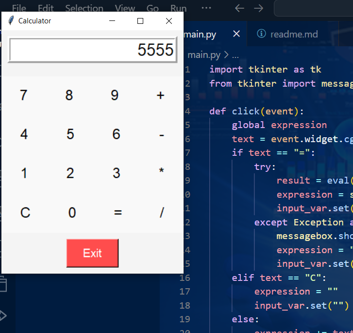

# GUI Calculator

A simple yet efficient GUI-based calculator built with Python's `tkinter` library. The calculator performs basic arithmetic operations and features an intuitive and user-friendly interface.

---

## 🎯 **Objective**
To create a responsive and visually appealing calculator application that supports basic mathematical operations.

---

## 🛠️ **Features**
1. **Basic Operations**:
   - Perform addition, subtraction, multiplication, and division.
2. **Clear Button**:
   - Reset the calculator's input field with a single click.
3. **Error Handling**:
   - Displays a user-friendly error message for invalid expressions.
4. **Equal Button**:
   - Evaluate the entered mathematical expression.
5. **Responsive UI**:
   - Dynamically resizes and adjusts to window size.

---

## 📦 **Requirements**
- Python 3.x
- Libraries:
  - `tkinter` (pre-installed with Python)

---

## 🚀 **How to Run**
1. Clone the repository or copy the source code into a Python file named `calculator.py`.
2. Open your terminal or command prompt.
3. Navigate to the directory containing the file.
4. Run the script:
   ```bash
   python calculator.py
   ```

---

## 🖥️ **Usage**
1. Launch the application by running the script.
2. Use the buttons to perform operations:
   - **Enter numbers** and **arithmetic operators** (`+`, `-`, `*`, `/`) using the provided buttons.
   - **Clear (`C`)**: Resets the input field.
   - **Equal (`=`)**: Computes the result of the entered expression.
3. Close the application by clicking the **Exit** button or using the standard close button on the window.

---

## 🛡️ **Error Handling**
- Invalid expressions (e.g., `5++2` or `10/0`) are handled gracefully with an error message displayed in a popup.

---

## 📸 **Screenshots**
### Initial Interface:


### Functional Demonstration:
1. Enter a calculation (e.g., `5+3`) and press `=`:
   - **Output**: `8`
2. Press `C` to clear the display.
3. Enter another calculation (e.g., `10/2*3`) and press `=`:
   - **Output**: `15`

---

## ✨ **Customization**
You can modify the appearance of the calculator by changing:
1. **Colors**: Adjust button, background, or text colors in the code.
2. **Fonts**: Update the `font` attributes to suit your preferences.

